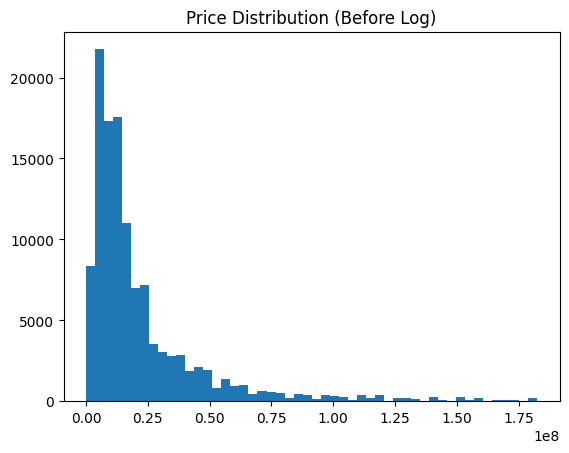

# 🏠 PropValue.pk — Pakistan House Price Prediction

> An end-to-end machine learning web application that predicts residential property prices across major Pakistani cities using a trained Random Forest model.


---

## 📌 Project Overview

**PropValue.pk** allows users to enter property details (city, location, area, bedrooms, bathrooms, property type) and instantly get an AI-powered price estimate in PKR. The system is built on a Random Forest Regressor trained on real Pakistan housing data, served via a FastAPI backend and consumed by a modern React + TypeScript frontend.

---

## 🗂️ Project Structure

```
HOUSEPRICEPREDICTION
│
├── 📓 analysis.ipynb          # Full EDA, feature engineering & model training
├── 🤖 xgb.pkl                  # Trained XGBoost model (saved via joblib)
├── 📋 features.pkl            # Training feature columns (for OHE alignment)
│
├── backend/
│   └── main.py                # FastAPI prediction API
│
└── frontend/
    └── src/
        ├── App.tsx             # Main React application
        └── data/
            └── cities.ts       # City, location & coordinates data
```

---

## 📊 Dataset

| Property | Details |

| Source | Pakistan Housing Dataset (CSV) |

| Target Variable | `price` (PKR) |

| Cleaning | Removed prices ≤ 0 and top 1% outliers |

| Dropped Columns | `property_id`, `purpose`, `date_added` |

| Final Features | `Total_Area`, `bedrooms`, `baths`, `latitude`, `longitude`, `location`, `city`, `property_type`, `province_name` |

---

## 🔬 Exploratory Data Analysis

### Price Distribution — Before vs After Log Transformation

Raw prices are heavily right-skewed. Applying `log1p()` normalizes the distribution, improving model performance.

 

Heavy right skew Near-normal distribution ✅

---

## ⚙️ Feature Engineering

Two new features were engineered from existing columns:

| Feature | Formula | Rationale |

| `log_area` | `log1p(Total_Area)` | Reduces area skewness, improves model fit |

| `room_ratio` | `bedrooms / (baths + 1)` | Captures room balance (useful price signal) |

Categorical columns (`location`, `city`, `property_type`, `province_name`) were encoded using `pd.get_dummies(drop_first=True)`.

---

## 🤖 Models Trained

Three regression models were trained and evaluated on an 80/20 train-test split with `random_state=42`.

### Model Configurations

```
| Model             | Key Hyperparameters |

| Linear Regression | Default (sklearn)   |

| Random Forest     | `n_estimators=300`, `max_depth=20`, `random_state=42` |

| **XGBoost ** ✅   | `n_estimators=300`, `lr=0.05`, `max_depth=6`, `subsample=0.8` |
```

---

## 📈 Results

### Model Comparison — R² Score

```
                    R² Score (Higher = Better)
                    ─────────────────────────────────────────────

Linear Regression   ██████████████████████░░░░░░░░░░░░   ~0.65

Random Forest       █████████████████████████████████░   ~0.85

XGBoost             █████████████████████████████████░   ~0.86 ✅
                    ─────────────────────────────────────────────
                    0.0       0.3       0.6       0.9    1.0
```

### Full Metrics Table

```
      Model               R2 Score       MAE        RMSE

0     Linear Regression   0.533889    0.429584    0.655670

1     Random Forest       0.851369    0.167238    0.370250

2     XGBoost             0.865599    0.198608    0.352081

```



> ✅ **XGBoost** was selected as the final production model — highest R² and lowest MAE/RMSE. Model was saved as `xgb.pkl`.

---

### Actual vs Predicted — XGBoost Model

## 

### 🏆 Top Feature Importances (XGBoost)

```
Feature  Importance
3                      bedrooms    0.284889
5              location_encoded    0.172132
9           property_type_House    0.110038
4                    Total_Area    0.083412
2                         baths    0.079213
8            property_type_Flat    0.049705
6                      log_area    0.042991
14               city_Islamabad    0.039513
18         province_name_Punjab    0.024042
13  property_type_Upper Portion    0.018265
```


> Geographic coordinates (latitude/longitude) are the strongest predictors, confirming that **location is the #1 driver of property price** in Pakistan.

---

## 🚀 Backend — FastAPI

**File:** `backend/main.py`

### Endpoints

| Method | Endpoint   | Description                    |
| ------ | ---------- | ------------------------------ |
| `GET`  | `/`        | API info & version             |
| `POST` | `/predict` | Returns predicted price in PKR |
| `GET`  | `/health`  | Health check                   |
| `GET`  | `/docs`    | Auto-generated Swagger UI      |

### Prediction Request (POST `/predict`)

```json
{
  "area": 2178,
  "bedrooms": 3,
  "baths": 2,
  "location": "DHA Defence",
  "city": "Lahore",
  "property_type": "House",
  "latitude": 31.4816,
  "longitude": 74.3985,
  "province_name": "Punjab"
}
```

### Prediction Response

```json
{
  "predicted_price": 28500000.0,
  "predicted_price_million": 28.5,
  "currency": "PKR",
  "input_received": {
    "area": 2178,
    "bedrooms": 3,
    "baths": 2,
    "location": "DHA Defence",
    "city": "Lahore",
    "property_type": "House",
    "province_name": "Punjab"
  }
}
```

### Preprocessing Pipeline (matches `analysis.ipynb` exactly)

```python
raw["log_area"]   = np.log1p(raw["Total_Area"])
raw["room_ratio"] = raw["bedrooms"] / (raw["baths"] + 1)
raw_encoded = pd.get_dummies(raw, drop_first=True)
raw_encoded = raw_encoded.reindex(columns=feature_columns, fill_value=0)
# Model predicts log1p(price) → reverse with np.expm1()
predicted_price = np.expm1(model.predict(input_df)[0])
```

### Running the Backend

```bash
pip install fastapi uvicorn scikit-learn joblib pandas numpy

uvicorn main:app --reload --port 8000
```

API will be live at: `http://localhost:8000`  
Swagger docs at: `http://localhost:8000/docs`

---

## 🎨 Frontend — React + TypeScript

**File:** `frontend/src/App.tsx`

### Tech Stack

| Technology            | Purpose                           |
| --------------------- | --------------------------------- |
| React 18 + TypeScript | UI framework                      |
| Tailwind CSS          | Styling (dark theme: `stone-950`) |
| Axios                 | HTTP requests to FastAPI          |
| Vite                  | Build tool                        |

### Key Features

- **City → Location cascade**: Selecting a city dynamically populates available localities
- **Auto lat/lng injection**: Coordinates are auto-filled from city data (user doesn't need to enter them)
- **Smart PKR formatting**: Results display as _Crore_ or _Lakh_ based on magnitude
- **Form validation**: Submit button disabled until all required fields are valid
- **Error handling**: Friendly Urdu/English error messages for backend connectivity issues

### UI Flow

```
┌─────────────────────────────────────────┐
│  PropValue.pk                           │
│  ─────────────────────────────────────  │
│  [City ▼]        [Location ▼]           │
│  [Property Type ▼]  [Area (sq ft)]      │
│  [Bedrooms]      [Bathrooms]            │
│                                         │
│       [ Estimate Price → ]              │
└─────────────────────────────────────────┘
              ↓ (on submit)
┌─────────────────────────────────────────┐
│  ← New estimate          Estimate ready │
│  ┌───────────────────────────────────┐  │
│  │   Estimated Price                 │  │
│  │   PKR 2.85 Crore                  │  │
│  │   ≈ PKR 28.500M                   │  │
│  └───────────────────────────────────┘  │
│  📍 City  🏠 Type  📐 Area             |
│  🛏 Beds  🚿 Baths  📌 Location        │
└─────────────────────────────────────────┘
```

### Running the Frontend

```bash
cd frontend
npm install
npm run dev
```

App will be live at: `http://localhost:5173`

> ⚠️ Make sure backend is running on port `8000` before using the app.

---

## 🔄 Full System Architecture

```
┌──────────────┐    POST /predict     ┌──────────────────────┐
│              │  ──────────────────► │                      │
│   React UI   │                      │   FastAPI Backend    │
│  (Port 5173) │  ◄────────────────── │     (Port 8000)      │
│              │   { price in PKR }   │                      │
└──────────────┘                      └──────────┬───────────┘
                                                 │
                                    ┌────────────▼────────────┐
                                    │  Random Forest Model    │
                                    │  rf.pkl + features.pkl  │
                                    │  (trained on housing    │
                                    │   dataset via notebook) │
                                    └─────────────────────────┘
```

---

## 🛠️ Installation & Setup

### Prerequisites

- Python 3.10+
- Node.js 18+
- npm or yarn

### 1. Clone the repository

```bash
git clone https://github.com/muhammadqazi24/house-price-prediction
cd HOUSEPRICEPREDICTION
```

### 2. Train the model (or use pre-trained)

```bash
jupyter notebook analysis.ipynb
# Run all cells — this generates rf.pkl and features.pkl
```

### 3. Start the backend

```bash
cd backend
pip install -r requirements.txt
uvicorn main:app --reload --port 8000
```

### 4. Start the frontend

```bash
cd frontend
npm install
npm run dev
```

### 5. Open the app

Navigate to `http://localhost:5173` 🎉

---

## 📦 Dependencies

### Backend (`requirements.txt`)

```
fastapi
uvicorn
scikit-learn
xgboost
joblib
pandas
numpy
pydantic
```

### Frontend

```
react, react-dom
typescript
axios
tailwindcss
vite
```

---

## 🔮 Future Improvements

- [ ] Add more cities and locations to the frontend dataset
- [ ] Integrate real-time Zameen.com data scraping for model retraining
- [ ] Add price trend charts (historical price by area/city)
- [ ] Deploy backend on Railway/Render and frontend on Vercel
- [ ] Add a map-based location picker (Leaflet.js / Google Maps)
- [ ] Hyperparameter tuning with GridSearchCV for RF and XGBoost

---

## 👨‍💻 Author

Built By Muhammad Ahmad Qazi using Python, FastAPI, React & scikit-learn.

---

_Predictions are based on historical data and may vary from actual market prices._
