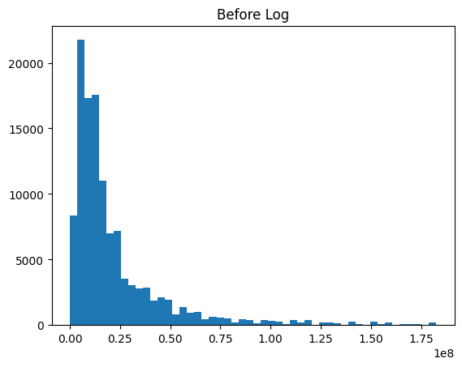
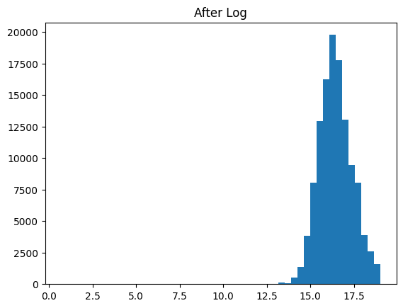
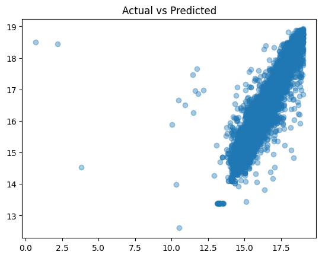
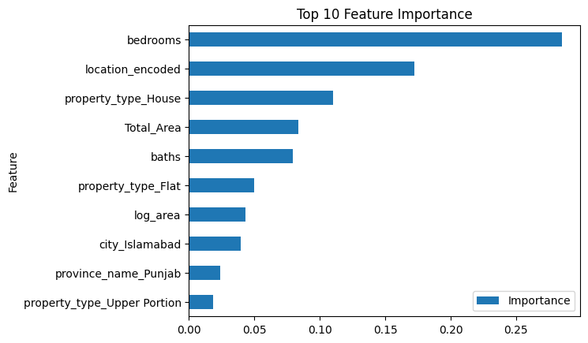
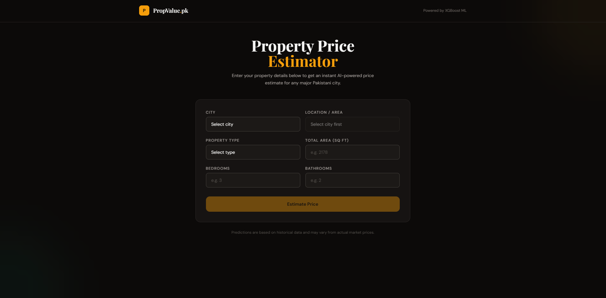

# PropValue.pk — Pakistan House Price Prediction

An end-to-end machine learning web application that predicts residential property prices across major Pakistani cities. Users enter property details and instantly receive an AI-powered price estimate in PKR.

---

## Table of Contents

- [Project Overview](#project-overview)
- [Objectives](#objectives)
- [Project Pipeline](#project-pipeline)
- [Dataset](#dataset)
- [Exploratory Data Analysis](#exploratory-data-analysis)
- [Feature Engineering](#feature-engineering)
- [Models Trained](#models-trained)
- [Results](#results)
- [Backend — FastAPI](#backend--fastapi)
- [Frontend — React + TypeScript](#frontend--react--typescript)
- [System Architecture](#system-architecture)
- [Installation & Setup](#installation--setup)
- [Limitations](#limitations)
- [Future Improvements](#future-improvements)

---

## Project Overview

PropValue.pk allows users to enter property details (city, location, area, bedrooms, bathrooms, property type) and instantly get a price estimate in PKR. The system is built on an XGBoost Regressor trained on real Pakistan housing data, served via a FastAPI backend and consumed by a React + TypeScript frontend.

---

## Objectives

- Build a machine learning model capable of predicting residential property prices across major Pakistani cities with high accuracy.
- Engineer meaningful features from raw housing data to improve model performance.
- Serve predictions through a production-ready REST API built with FastAPI.
- Provide a clean, user-friendly web interface that non-technical users can interact with.
- Establish a full-stack ML pipeline from raw data to deployed web application.

---

## Project Pipeline

The project follows a structured end-to-end ML pipeline:

```
Raw Data
   |
   v
Data Cleaning & Preprocessing
   |
   |-- Remove invalid prices (price <= 0)
   |-- Drop outliers (top 1% prices)
   |-- Drop irrelevant columns (property_id, purpose, date_added)
   |
   v
Exploratory Data Analysis
   |
   |-- Price distribution analysis (before/after log transform)
   |-- Correlation analysis between features and price
   |-- Geographic price distribution by city
   |
   v
Feature Engineering
   |
   |-- log_area = log1p(Total_Area)        # Reduce area skewness
   |-- room_ratio = bedrooms / (baths + 1) # Capture room balance
   |-- One-hot encoding for categorical columns
   |
   v
Model Training & Evaluation
   |
   |-- Linear Regression (baseline)
   |-- Random Forest Regressor
   |-- XGBoost Regressor (selected)
   |-- Evaluation: R2 Score, MAE, RMSE
   |
   v
Model Serialization
   |
   |-- xgb.pkl         (trained XGBoost model)
   |-- features.pkl    (training feature columns for OHE alignment)
   |
   v
FastAPI Backend
   |
   |-- Loads model and feature columns on startup
   |-- Accepts POST /predict with property details
   |-- Applies same preprocessing pipeline as training
   |-- Returns predicted price via np.expm1() reverse transform
   |
   v
React + TypeScript Frontend
   |
   |-- City -> Location cascade dropdowns
   |-- Auto lat/lng injection from city data
   |-- Sends POST request to FastAPI backend
   |-- Displays result formatted in Crore / Lakh
```

Each stage feeds directly into the next — the preprocessing logic in `analysis.ipynb` is replicated exactly in `backend/main.py` to ensure training and inference are consistent.

---

## Dataset

| Property | Details |
|---|---|
| Source | Pakistan Housing Dataset (CSV) |
| Target Variable | `price` (PKR) |
| Cleaning | Removed prices <= 0 and top 1% outliers |
| Dropped Columns | `property_id`, `purpose`, `date_added` |
| Final Features | `Total_Area`, `bedrooms`, `baths`, `latitude`, `longitude`, `location`, `city`, `property_type`, `province_name` |

---

## Exploratory Data Analysis

### Price Distribution — Before Log Transformation

Raw prices are heavily right-skewed due to extreme outliers in luxury property segments. Most properties cluster in the lower price range, making it difficult for models to learn meaningful patterns.



### Price Distribution — After Log Transformation

Applying `log1p()` to the target variable normalizes the distribution significantly. This improves model stability, reduces the influence of outliers, and leads to better generalization across price ranges.



---

## Feature Engineering

Two new features were engineered from existing columns:

| Feature | Formula | Rationale |
|---|---|---|
| `log_area` | `log1p(Total_Area)` | Reduces area skewness, improves model fit |
| `room_ratio` | `bedrooms / (baths + 1)` | Captures room balance as a useful price signal |

Categorical columns (`location`, `city`, `property_type`, `province_name`) were encoded using `pd.get_dummies(drop_first=True)`. The resulting feature columns are saved in `features.pkl` and used at inference time to ensure the input matches the training schema exactly.

---

## Models Trained

Three regression models were trained and evaluated on an 80/20 train-test split with `random_state=42`.

| Model | Key Hyperparameters |
|---|---|
| Linear Regression | Default (sklearn) |
| Random Forest | `n_estimators=300`, `max_depth=20`, `random_state=42` |
| XGBoost | `n_estimators=300`, `lr=0.05`, `max_depth=6`, `subsample=0.8` |

---

## Results

### Model Comparison

```
                    R2 Score (Higher = Better)
                    ─────────────────────────────────────────────

Linear Regression   ██████████████████████░░░░░░░░░░░░   ~0.65

Random Forest       █████████████████████████████████░   ~0.85

XGBoost             █████████████████████████████████░   ~0.86
                    ─────────────────────────────────────────────
                    0.0       0.3       0.6       0.9    1.0
```

### Full Metrics

| Model | R2 Score | MAE | RMSE |
|---|---|---|---|
| Linear Regression | 0.5339 | 0.4296 | 0.6557 |
| Random Forest | 0.8514 | 0.1672 | 0.3703 |
| XGBoost | 0.8656 | 0.1986 | 0.3521 |


XGBoost was selected as the final production model based on highest R2 score and lowest RMSE. The model was serialized as `xgb.pkl` using joblib.

### Actual vs Predicted — XGBoost

The scatter plot below shows predicted prices against actual prices on the test set. Points close to the diagonal line indicate accurate predictions. The model performs well across mid-range properties but shows some variance at very high price points due to limited training samples in that range.



### Feature Importances — XGBoost

The chart below ranks features by their contribution to the model's predictions. Bedrooms and location encoding dominate, confirming that property size and geographic positioning are the primary drivers of price in the Pakistani housing market.



| Feature | Importance |
|---|---|
| bedrooms | 0.2849 |
| location_encoded | 0.1721 |
| property_type_House | 0.1100 |
| Total_Area | 0.0834 |
| baths | 0.0792 |
| property_type_Flat | 0.0497 |
| log_area | 0.0430 |
| city_Islamabad | 0.0395 |
| province_name_Punjab | 0.0240 |
| property_type_Upper Portion | 0.0183 |

---

## Backend — FastAPI

**File:** `backend/main.py`

The backend is a lightweight REST API built with FastAPI that loads the trained XGBoost model on startup and exposes a `/predict` endpoint. Incoming requests are preprocessed using the exact same pipeline as training — including log transformation, feature engineering, and one-hot encoding alignment via `features.pkl` — before being passed to the model. The predicted log price is then reversed with `np.expm1()` to return the actual PKR value.

### Endpoints

| Method | Endpoint | Description |
|---|---|---|
| `GET` | `/` | API info and version |
| `POST` | `/predict` | Returns predicted price in PKR |
| `GET` | `/health` | Health check |
| `GET` | `/docs` | Auto-generated Swagger UI |

### Prediction Request

```json
{
  "area": 2178,
  "bedrooms": 3,
  "baths": 2,
  "location": "DHA Defence",
  "city": "Lahore",
  "property_type": "House",
  "latitude": 31.4816,
  "longitude": 74.3985,
  "province_name": "Punjab"
}
```

### Prediction Response

```json
{
  "predicted_price": 28500000.0,
  "predicted_price_million": 28.5,
  "currency": "PKR",
  "input_received": {
    "area": 2178,
    "bedrooms": 3,
    "baths": 2,
    "location": "DHA Defence",
    "city": "Lahore",
    "property_type": "House",
    "province_name": "Punjab"
  }
}
```

### Preprocessing Pipeline

The backend replicates the exact same preprocessing steps used during model training to avoid training-serving skew:

```python
raw["log_area"]   = np.log1p(raw["Total_Area"])
raw["room_ratio"] = raw["bedrooms"] / (raw["baths"] + 1)
raw_encoded = pd.get_dummies(raw, drop_first=True)
raw_encoded = raw_encoded.reindex(columns=feature_columns, fill_value=0)
predicted_price = np.expm1(model.predict(input_df)[0])
```

### Running the Backend

```bash
pip install fastapi uvicorn scikit-learn joblib pandas numpy
uvicorn main:app --reload --port 8000
```

API will be live at `http://localhost:8000` — Swagger docs at `http://localhost:8000/docs`

---

## Frontend — React + TypeScript

**File:** `frontend/src/App.tsx`

The frontend is a single-page application built with React and TypeScript, styled with Tailwind CSS using a dark stone theme. It communicates with the FastAPI backend via Axios to submit property details and display the predicted price. The UI handles city-to-location cascading, automatic coordinate injection, and formats the result intelligently in Crore or Lakh depending on the magnitude of the prediction.

### Tech Stack

| Technology | Purpose |
|---|---|
| React 18 + TypeScript | UI framework and type safety |
| Tailwind CSS | Utility-first styling with dark theme (`stone-950`) |
| Axios | HTTP client for communicating with the FastAPI backend |
| Vite | Fast development server and build tool |

### Key Features

- City to Location cascade: selecting a city dynamically populates available localities
- Auto lat/lng injection: coordinates are auto-filled from city data so users do not need to enter them manually
- Smart PKR formatting: results display as Crore or Lakh based on magnitude
- Form validation: submit button disabled until all required fields are filled
- Error handling: friendly error messages for backend connectivity issues

The interface below shows the prediction result screen after a user submits property details. The estimated price is displayed prominently with a breakdown of the inputs used.



### Running the Frontend

```bash
cd frontend
npm install
npm run dev
```

App will be live at `http://localhost:5173`. Make sure the backend is running on port `8000` before using the app.

---

## System Architecture

```
+----------------+    POST /predict     +----------------------+
|                |  ─────────────────►  |                      |
|   React UI     |                      |   FastAPI Backend    |
|  (Port 5173)   |  ◄─────────────────  |     (Port 8000)      |
|                |   { price in PKR }   |                      |
+----------------+                      +----------+-----------+
                                                   |
                                      +------------v------------+
                                      |   XGBoost Model         |
                                      |   xgb.pkl               |
                                      |   features.pkl          |
                                      |   (trained on Pakistan  |
                                      |    housing dataset)     |
                                      +-------------------------+
```

---

## Installation & Setup

### Prerequisites

- Python 3.10+
- Node.js 18+
- npm or yarn

### 1. Clone the repository

```bash
git clone https://github.com/muhammadqazi24/house-price-prediction
cd house-price-prediction
```

### 2. Train the model

```bash
jupyter notebook analysis.ipynb
# Run all cells — generates xgb.pkl and features.pkl
```

### 3. Start the backend

```bash
cd backend
pip install -r requirements.txt
uvicorn main:app --reload --port 8000
```

### 4. Start the frontend

```bash
cd frontend
npm install
npm run dev
```

### 5. Open the app

Navigate to `http://localhost:5173`

---

## Dependencies

### Backend

The backend relies on a minimal set of Python packages. FastAPI and Uvicorn handle the API layer, while the ML stack (scikit-learn, XGBoost, joblib) is responsible for loading and running the trained model. Pandas and NumPy handle data transformation during inference, and Pydantic is used for request validation.

```
fastapi        # Web framework for building the REST API
uvicorn        # ASGI server for running the FastAPI app
scikit-learn   # Used for preprocessing utilities and model compatibility
xgboost        # The core prediction model
joblib         # Model and feature column serialization
pandas         # DataFrame operations during preprocessing
numpy          # Numerical operations and log transformations
pydantic       # Request body validation and schema definition
```

### Frontend

The frontend uses a lightweight React + TypeScript setup powered by Vite for fast development and builds. Tailwind CSS handles all styling without writing custom CSS, and Axios manages HTTP communication with the backend cleanly with support for error handling and response typing.

```
react            # Core UI library for building the component tree
react-dom        # DOM rendering for React components
typescript       # Static typing for safer and more maintainable code
axios            # Promise-based HTTP client for backend API calls
tailwindcss      # Utility-first CSS framework for rapid UI styling
vite             # Fast build tool and development server
```

---

## Limitations

- **Geographic coverage**: The model is trained on data from a limited number of Pakistani cities. Properties in smaller cities or rural areas will likely produce inaccurate estimates.
- **Data staleness**: The training dataset reflects historical market prices and does not account for recent market fluctuations, inflation, or new developments.
- **Location granularity**: Location is encoded as a categorical variable. New or unseen localities at inference time are treated as unknown, which reduces prediction accuracy for those areas.
- **High-end property variance**: The model shows higher prediction error at the upper end of the price range due to limited training samples for luxury properties.
- **Static coordinates**: Latitude and longitude are pre-assigned per city rather than per specific locality, which reduces geographic precision compared to parcel-level coordinates.
- **No real-time data**: The system does not integrate with any live property listing source. Predictions are based solely on the static training dataset.

---

## Future Improvements

- Add more cities and localities to the frontend dataset
- Integrate real-time Zameen.com data scraping for periodic model retraining
- Add price trend charts showing historical price movement by area and city
- Deploy backend on Railway or Render and frontend on Vercel
- Add a map-based location picker using Leaflet.js or Google Maps
- Hyperparameter tuning with GridSearchCV for Random Forest and XGBoost
- Add confidence intervals to predictions to communicate uncertainty to users

---

Built by Muhammad Ahmad Qazi using Python, FastAPI, React, and scikit-learn.

*Predictions are based on historical data and may vary from actual market prices.*
